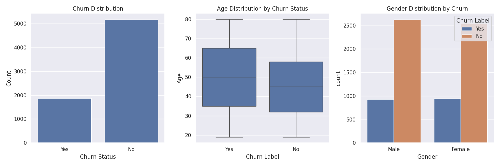

# Telco Customer Churn Analysis


## 📊 Project Overview
This project analyzes customer churn in a telecommunications company using machine learning and data visualization techniques. The analysis is based on the [IBM Telco Customer Churn Dataset from Kaggle](https://www.kaggle.com/datasets/yeanzc/telco-customer-churn-ibm-dataset). The analysis includes customer demographics, service usage patterns, and predictive modeling to identify key factors contributing to customer churn.
This project analyzes customer churn in a telecommunications company using machine learning and data visualization techniques. The analysis includes customer demographics, service usage patterns, and predictive modeling to identify key factors contributing to customer churn.




## Project Structure
- `PRO_1.py`: Initial exploratory data analysis and basic statistics
- `PRO_2.py`: Advanced analysis with visualizations and machine learning model
- `analysis_summary.py`: Executive summary with key findings and recommendations
- `plotly_visuals.py`: Generates interactive Plotly charts
- `plots/`: Directory containing generated visualizations
- `telco.csv`: Original dataset

## Key Findings
- Overall churn rate: 26.54%
- Fiber Optic service has highest churn rate (40.72%)
- Top churn reasons are competitor-related (better devices, better offers)
- Model achieves 92% accuracy in predicting churn

## Visualizations
The project generates six key visualizations:
1. Customer Demographics Analysis
2. Customer Value Analysis
3. Service Usage Patterns
4. Top Churn Reasons
5. Correlation Analysis
6. Feature Importance in Churn Prediction
Interactive versions of these visuals are generated with Plotly and saved
as HTML files in `plots/interactive` when running `plotly_visuals.py`.


## Model Performance
Random Forest Classifier Results:
- Overall Accuracy: 92%
- Precision: 93% (Non-churn), 90% (Churn)
- Recall: 96% (Non-churn), 81% (Churn)
 

## Requirements
- Python 3.x
- pandas
- numpy
- matplotlib
- seaborn
- scikit-learn
- plotly

## Usage
1. Clone the repository
2. Ensure all required packages are installed
3. Run the scripts in order:
   ```bash
   python3 PRO_1.py
   python3 PRO_2.py
   python3 plotly_visuals.py  # generates interactive charts
   python3 analysis_summary.py
   ```

## Recommendations
1. Service Improvement:
   - Focus on Fiber Optic service quality
   - Enhance device offerings
   - Implement competitive pricing

2. Customer Support:
   - Improve support staff training
   - Implement regular satisfaction surveys
   - Develop proactive support protocols

3. Retention Strategy:
   - Target high-risk customers
   - Create competitive counter-offers
   - Focus on early tenure customers

## License
MIT License
